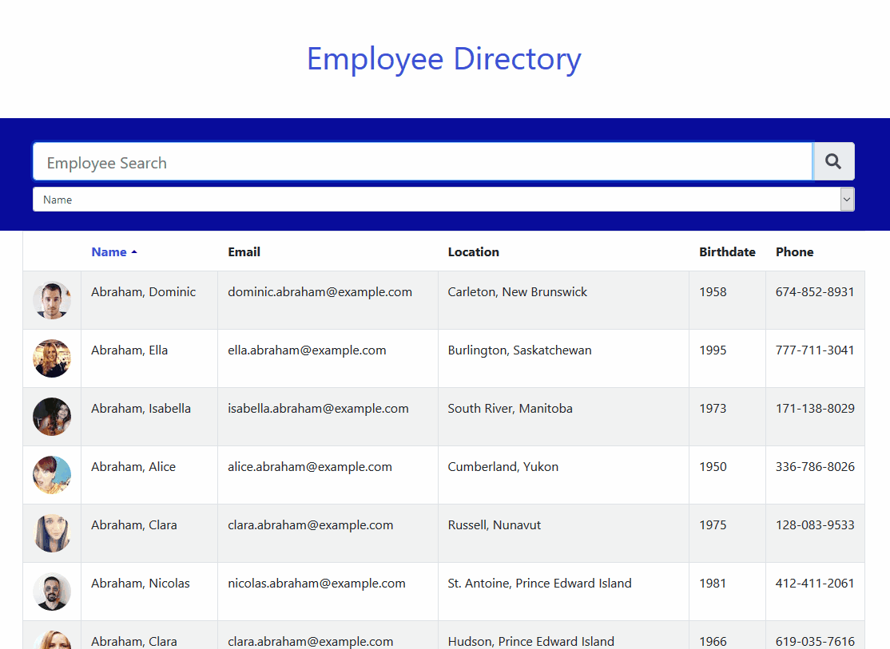

# Employee Directory

A React web application for viewing a database of employees.  Searchable using any criteria, name, email, location, etc.  Sortable based on any criteria as well. Created to help manage the contact information of large and diverse organizations.  Can be found deployed on Heroku [here](https://react-employee-directory-jl.herokuapp.com).

## Technologies

* React
* Node
* Express
* React-Bootstrap
* Sass

## Usage

From the main page search text can be entered in the search field.  Options for which field to search, defaulting to name, are below the search field.  Each column can be sorted on by selecting the column title.  Additional information about each individual can be viewed in a modal by clicking on their name.

## Author
Created bv James Lee.

## Credits

* [Node](https://nodejs.org/en/)
* [React](https://reactjs.org/)
* [React-Bootstrap](https://github.com/react-bootstrap/react-bootstrap)
* [Random User Generator](https://randomuser.me)
* [Express](https://expressjs.com/)
* [Sass](https://sass-lang.com/)

## License

[MIT](https://choosealicense.com/licenses/mit/)